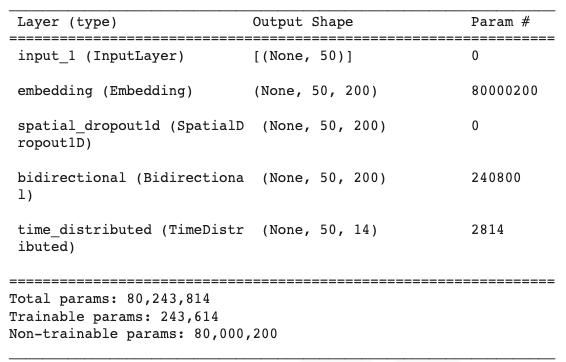
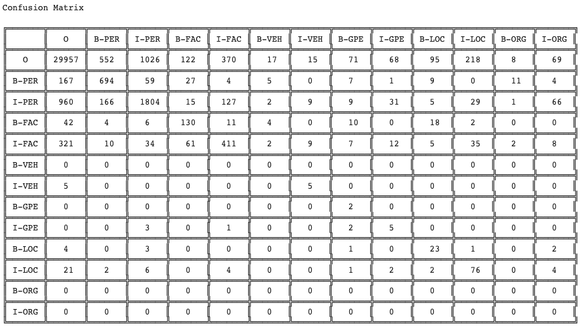

# NLP-Information-Extraction-Project
| Developer Name | VCU Email Address | Github Username |
| :---: | :---: | :---: |
| Charles Cutler | cutlerci@vcu.edu | cutlerci |
| Christopher Smith | samsoncr@vcu.edu | samsoncr |
| Majd Alkawaas | alkawaasm@vcu.edu | MajdAlkawaas |

# For creating the table of contents
http://ecotrust-canada.github.io/markdown-toc/

# Project description

This program was created with the intention of combining what we have learned so far in the VCU Advanced Natural Language Processing course to build a model to classify named entities from a training corpus. Then to perform information extraction by applying the trained model to tweets we pull from Twitter. We were allowed to train our model to complete the information extraction task with a dataset of our choice. 

Information extraction is a classification problem in which our code will try to determine whether a word or symbol is considered a named entity. Named entities in our dataset cover six of the ACE 2005 classes in text:
* People (PER): *Tom Sawyer*, *her daughter*
* Facilities (FAC): *the house*, *the kitchen*
* Geo-political entities (GPE): *London*, *the village*
* Locations (LOC): *the forest*, *the river*
* Vehicles (VEH): *the ship*, *the car*
* Organizations (ORG): *the army*, *the Church*

A named entity can be of the 6 above classes and is preceded either by a "B-" or an "I-". A "B-" denotes that the word is the beginning of a named entity and an "I-" denotes that the word is an inclusive member of the named entity. If a word or symbol is not considered any of the above entities it is marked with an O. Given any sequence of words or symbols, referred to as tokens, our model will label each token as one of the named entity classes or as an O. Then we must analyze the accuracy of our model. We do this by comparing the model’s predictions to labels made by humans which are assumed to be the correct classification. The model for information extraction is a collection of Bidirectional Long Short Term Memory Units ( BiLSTM ) with a Conditional Random Field ( CRF ) layer for classification. 

The whole process is a series of steps beginning by preprocessing a large training dataset. The data used for this project can be found in the Data sub-directory. The dataset contains sentences from 100 literary works in which every token has been classified. These sentences must be preprocessed before being vectorized and embedded. After its transformation, the data can then be given to the BiLSTM + CRF model. The model will learn from the data how to predict whether a token is a named entity or not and, if so, what named entity it is. We then collect the predictions of our model on a test set of data, and for our results we calculate the precision, recall, F1, and accuracy scores of our predictions.

Each of these steps are explained in further detail in the sections below.

# Installation instructions

Begin by downloading the NER_on_Preprocessed_LitBank_Dataset.ipynb file from in the Code sub-directory. You can follow this tutorial for downloading a single file from github: 

<small><i><a href='https://www.wikihow.com/Download-a-File-from-GitHub'>Downloading a Single File From GitHib</a></i></small>

Follow the same instructions for downloading the cleaned data set file called ProcessedLitBankDataset.csv found in the Data sub-directory.

You will also need the glove.6B.200d.txt file which can be downloaded from 
<small><i><a href='https://www.kaggle.com/datasets/incorpes/glove6b200d'>glove.6b.200d.txt</a></i></small>
 
This file may be too big to download, however, so you can use this public Google Drive link https://drive.google.com/file/d/1VGGnJMZZgBG0_MCqb2mafvzgMT1NDJ1i/view?usp=share_link to upload the file to your drive. Click the link and use ZIP Extractor to extract the file to Google Drive.

 

You can skip the downloads of NER_on_Preprocessed_LitBank_Dataset.ipynb and ProcessedLitBankDataset.csv if you already have downloaded the whole project as a zip file. This can be done by clicking on the green button that says "code" in the main directory of the github page (same directory as this README), and then clicking on "Download ZIP".

We recommend using Google Colab to run the code. To do so, go to Google Drive at drive.google.com. From your downloads on your local machine, upload the two files, NER_on_Preprocessed_LitBank_Dataset.ipynb and ProcessedLitBankDataset.csv, to your Google Drive. 

Do the same for glove.6B.200d.txt either from your own downloads or the previous link. Make sure they are uploaded to your MyDrive folder in Google Drive.

If you choose to run the code locally, you must install Python and the necessary packages for TensorFlow, Numpy, Keras, and SKLearn.
Tutorials for installing Python and these libraries can be found at these links:

https://realpython.com/installing-python/

https://www.tensorflow.org/install 

https://numpy.org/install/ 

https://www.tutorialspoint.com/keras/keras_installation.htm 

https://scikit-learn.org/stable/install.html 

# Usage instructions

Open the NER_on_Preprocessed_LitBank_Dataset.ipynb file in your Google Drive. There are two lines of code that need to be uncommented before running in Google Colab. Additionally the BASE FILE PATH must be changed.  Read through the comments for more guidance through this process.

Then click on the runtime tab, and click run all.

If you chose to run the file locally, you will need to instead replace the file path names with the local file paths. This also means that you will have to download the glove.6B.200d.txt file from <small><i><a href='https://www.kaggle.com/datasets/incorpes/glove6b200d'>glove.6b.200d.txt'>glove.6B.200d.txt</a></i></small>. Read through the comments at the top of the page in NER_on_Preprocessed_LitBank_Dataset.ipynb for more details on changing the path names. You can export NER_on_Preprocessed_LitBank_Dataset.ipynb as a .py file and then run it on the command line by navigating to the directory containing the file and using the command: python3 NER_on_Preprocessed_LitBank_Dataset.py

# Method
## Preprocessing
For preprocessing on the dataset, once the nested entities were collapsed we needed to extract each sentence from the dataset. We built a custom class to handle extracting each sentence from the dataset and return them as lists of 2-tuple pairs. 

## Feature Extraction and Vectorization
Once the data was extracted it is necessary to turn the words of the tweet into a numerical representations that can be used to train a machine learning model. To build these numerical representations we first needed to build some helper tools.

## Build some tools: Static Word Embeddings with Glove
To determine the numerical representations of sentences it is neccesary to first define some useful tools. We used ``GloVe: Global Vectors for Word Representation`` to construct two tools that together can be used to convert each token found within a sentence into a numerical vector. The collection of all the individual token vectors then makeup the numerical representation of a sentence. 

The first tool is the ``embedding array``. This array consists of the individual token vectors that are in the GloVe database.

The second tool that goes right along with the first one is the ``index mapping``. This tool allows for the tokens in the sentences to be converted into a single dimensional numerical vector that acts and the intermediary between tokens and token embeddings. It contains the index location for every word that is in the Embeddings Array. For example, the word representation for ``Dogs`` might be stored in the second line in the ``Embeddings Array``. So in the ``Index Mapping`` the word ``Dogs`` would be matched with the number 2, representing its storage location in ``Embeddings Array``. 

## Information Extraction / Classification using machine learning

For classification we used a collection of Bidirectional Long Short Term Memory Units ( BiLSTM ) with a Conditional Random Field ( CRF ). We used the following layers:

# Data 
## Original Data
We used the LitBank dataset that can be found online at: [LitBank](https://github.com/dbamman/litbank). This dataset contains words from 100 English works of fiction (novels and short stories) drawn from the Project Gutenberg public domain found online here: [Project Gutenberg](https://www.gutenberg.org/). The LitBank dataset uses named entities that cover six of the ACE 2005 classes in text:
* People (PER): *Tom Sawyer*, *her daughter*
* Facilities (FAC): *the house*, *the kitchen*
* Geo-political entities (GPE): *London*, *the village*
* Locations (LOC): *the forest*, *the river*
* Vehicles (VEH): *the ship*, *the car*
* Organizations (ORG): *the army*, *the Church*

If a word or symbol is not considered any of the above entities it is marked with an *O*. The 100 English works of fiction can be found in the Data sub-directory in the Original Data ( TSV Format ) folder. Each novel or short story is stored as an individual TSV file.

The original dataset has nested named entities. For example, 

 

## Cleaned Data
The "collapseNestedNamedEntities.py" python script that we wrote generated a cleaner version of the LitBank dataset. Specifically we did the following preprocessing tasks to clean the data into the format we wanted for training our model:
* We dealt with these by collapsing the nested layers, selecting the highest non *O* named entity for each token. 
* We appended every sentence from every book into one large file to better be used for training our model.

This clean version of the dataset can be found in the Data sub-directory as "ProcessedLitBankDataset.csv"

We split the data set into three pieces for use in training and evaluation of the model. We use an __ train, __ development or validation, and __ test split.

# Results
## Confusion Matrix

## Training Versus Validation Loss

## Precision, Recall, and F1 Performance Measures

# Discussion

# Future Work
